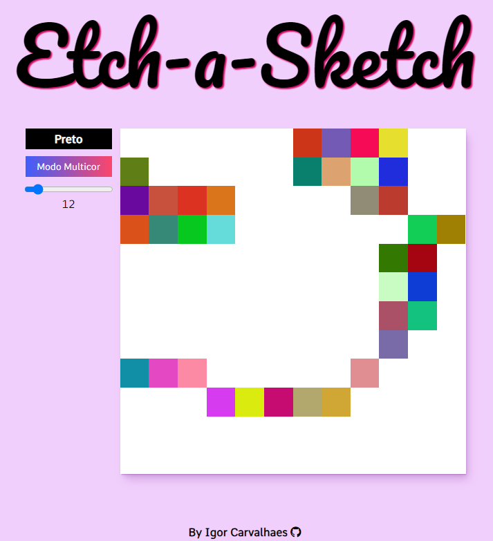

# Etch-a-Sketch

This project is a digital recreation of the classic Etch-a-Sketch toy. It allows users to create sketches on a grid-based sketchpad, adjusting the grid size and choosing between monochromatic or multicolor drawing modes.

## Features

- **Dynamic Grid Size**: Use the slider to select the number of squares per row and column, allowing for a customizable drawing area.
- **Color Modes**: Choose between drawing in black or multicolor mode.

## How to Use

1. **Adjust Grid Size**: Move the slider to select the desired number of squares per row and column.
2. **Select Color Mode**: Choose between black or multicolor drawing modes.
3. **Start Drawing**: Click and drag on the sketchpad to create your drawing.

## Technologies Used

- **HTML**: Provides the structure for the sketchpad and UI elements.
- **CSS**: Styles the sketchpad and other UI components for a visually appealing interface.
- **JavaScript**: Implements the functionality of the sketchpad, including grid generation, color selection, and drawing mechanics.

## Screenshots

---

## Português

Este projeto é uma recriação digital do clássico brinquedo Etch-a-Sketch. Ele permite aos usuários criar desenhos em uma tela de esboço baseada em grade, ajustando o tamanho da grade e escolhendo entre modos de desenho monocromáticos ou multicoloridos.

### Funcionalidades

- **Tamanho Dinâmico da Grade**: Use o slider para selecionar o número de quadrados por linha e coluna, permitindo uma área de desenho personalizável.
- **Modos de Cor**: Escolha entre desenhar em preto ou no modo multicolorido.

### Como Usar

1. **Ajustar Tamanho da Grade**: Mova o controle deslizante para selecionar o número desejado de quadrados por linha e coluna.
2. **Selecionar Modo de Cor**: Escolha entre modos de desenho preto ou multicolorido.
3. **Começar a Desenhar**: Clique e arraste na tela de esboço para criar seu desenho.

### Tecnologias Utilizadas

- **HTML**: Fornece a estrutura para a tela de esboço e elementos da interface do usuário.
- **CSS**: Estiliza a tela de esboço e outros componentes da interface do usuário para uma interface visualmente atraente.
- **JavaScript**: Implementa a funcionalidade da tela de esboço, incluindo geração de grade, seleção de cores e mecânicas de desenho.
